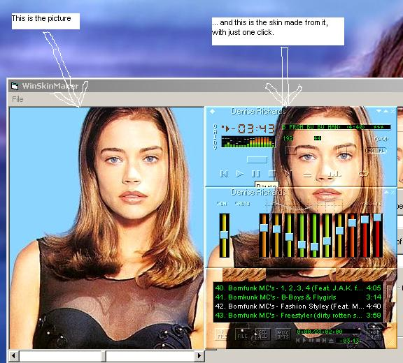



## A Skiner for Winamp

### Description

WinSkinMaker transforms a picture into a skin for Winamp(see the screen shot).You just have to choose the picture and give a (single!) click.Is in pure Visual Basic.
 
### More Info
 

             |
---                |---
**Submitted On**   |2001-05-10 16:15:14
**By**             |[Bog Crist](https://github.com/Planet-Source-Code/PSCIndex/blob/master/ByAuthor/bog-crist.md)
**Level**          |Intermediate
**User Rating**    |4.7 (47 globes from 10 users)
**Compatibility**  |VB 6\.0
**Category**       |[Graphics](https://github.com/Planet-Source-Code/PSCIndex/blob/master/ByCategory/graphics__1-46.md)
**World**          |[Visual Basic](https://github.com/Planet-Source-Code/PSCIndex/blob/master/ByWorld/visual-basic.md)
**Archive File**   |[WinSkinMak194675102001\.zip](https://github.com/Planet-Source-Code/bog-crist-a-skiner-for-winamp__1-23048/archive/master.zip)

